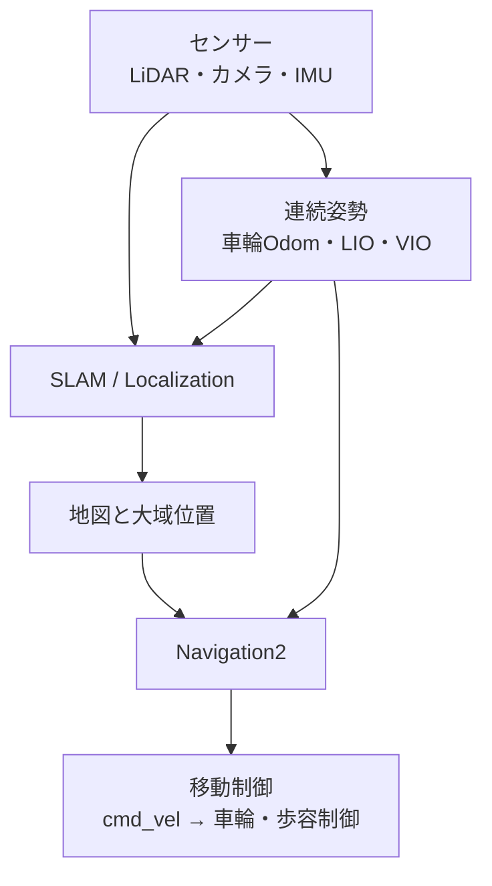
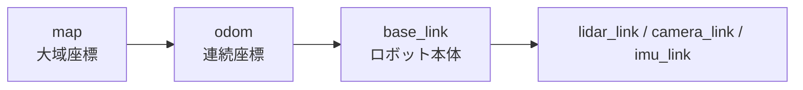
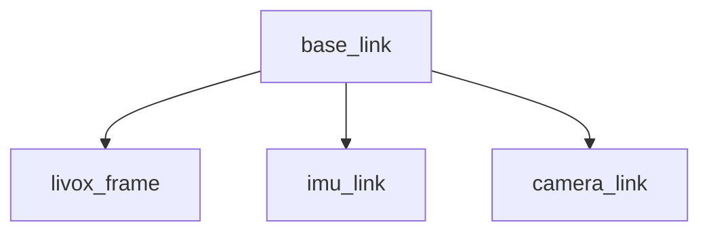
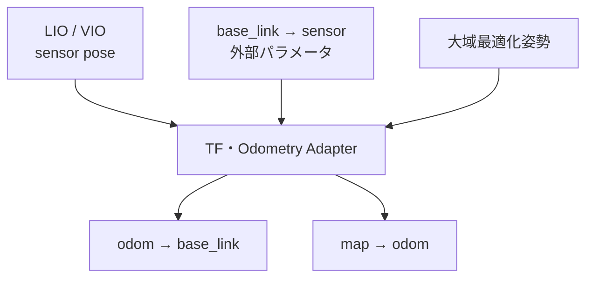
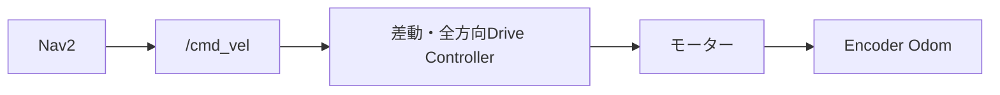
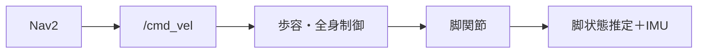
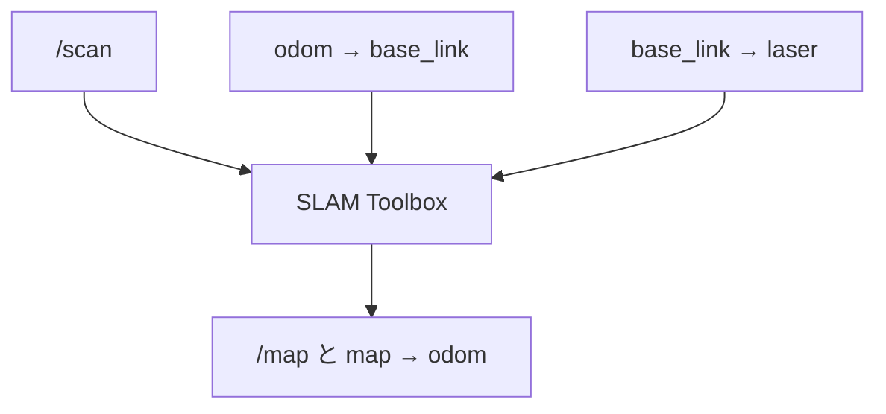
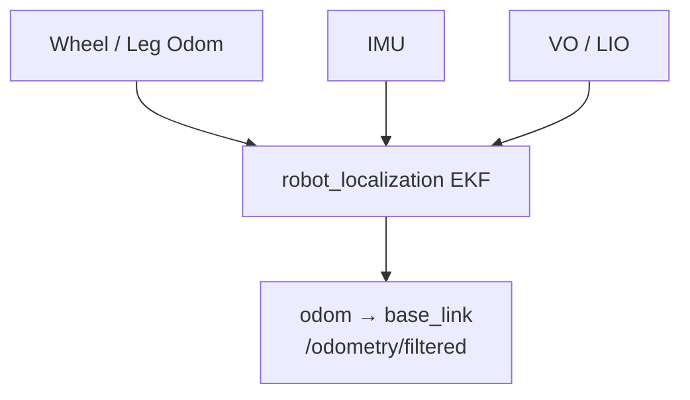
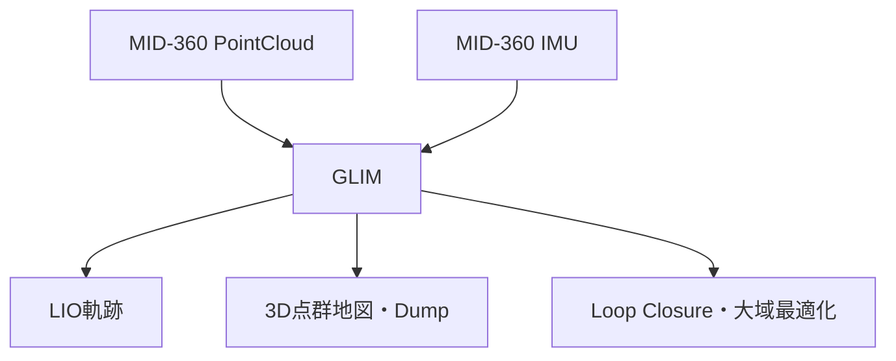
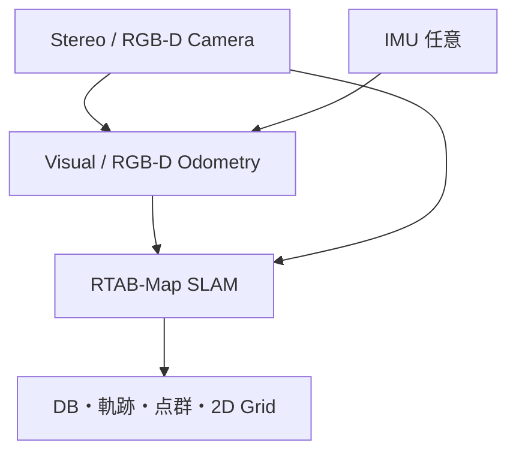

# ROS 2でSLAMとNavigation2をつなぐための学習教材

対象環境：Ubuntu 22.04 / ROS 2 Humble  
情報確認日：2026-07-28

## この教材の目的

この教材は，SLAM内部の数式や最適化手法を詳しく学ぶことよりも，次の要素をROS 2上でどう接続すれば，移動ロボットの地図作成・自己位置推定・自律移動が成立するのかを理解することを目的とする．

- LiDAR，カメラ，IMUなどのセンサー
- 車輪・脚・LiDAR・カメラから計算したオドメトリ
- TF座標系
- SLAMまたは既存地図上での自己位置推定
- Navigation2（Nav2）
- ロボットの移動制御

アルゴリズムを選ぶ前に，まず「各ソフトウェアが何を入力し，何を出力し，どの座標系を担当するのか」を理解する．

---

## 0．最初に結論

### 0.1 SLAMだけではロボットは自律移動しない

SLAMの主な役割は，次の2つである．

1. センサーを動かしながら地図を作る
2. 作成中の地図に対するセンサーまたはロボットの位置を推定する

一方，Nav2の役割は，地図と現在位置を受け取り，目的地までの経路と速度指令を生成することである．



SLAMとNav2は別システムであり，両者をつなぐ共通インタフェースが，ROSメッセージとTFである．

### 0.2 車輪オドメトリは必須ではないが，連続的なローカル姿勢は必要

SLAMによって必要な入力は異なる．

- `slam_toolbox`では，通常，2D LiDARと`odom -> base_link`が必要である．
- Cartographer 2Dでは，オドメトリとIMUを使わず，LiDARのスキャンマッチングだけで動作させる構成も可能である．
- GLIM，FAST-LIO2，LIO-SAMなどは，LiDARとIMUからLiDAR-Inertial Odometry（LIO）を内部で計算できるため，車輪オドメトリは不要である．
- Visual SLAMは，連続画像からVisual Odometry（VO）を計算できる．カメラとIMUを組み合わせる場合はVisual-Inertial Odometry（VIO）となる．

ただし，Nav2を動かす段階では，最終的に連続して変化する`odom -> base_link`相当の姿勢が必要になる．車輪オドメトリがなくても，LIOやVIOがその役割を担当すればよい．

### 0.3 IMU単独は，通常，位置オドメトリの代わりにならない

「IMUベースでオドメトリ不要」という言い方は，正確には次の意味である．

> 車輪や脚から計算するオドメトリは不要だが，LiDAR＋IMUまたはカメラ＋IMUから，SLAM側がオドメトリを生成する．

IMUの加速度を2回積分して位置を求めるだけでは，わずかなバイアスや姿勢誤差が急速に蓄積する．そのため，IMU単独による長時間の位置推定は現実的ではない．

### 0.4 人がセンサーを持って地図を作ることは可能

次の構成では，センサーをロボットに載せず，人が持って歩くだけで地図と軌跡を作れる．

- Livox MID-360などの3D LiDAR＋IMUをGLIMやLIO系に入力する
- ステレオカメラまたはRGB-DカメラをRTAB-Mapに入力する
- ステレオカメラ＋IMUをVIO/VSLAMに入力する

このとき，車輪エンコーダ，`/cmd_vel`，Nav2は不要である．必要なのは，センサー時刻，LiDARとIMUまたはカメラとIMUの外部キャリブレーション，正しいデータ形式である．

ただし，作った地図を後でロボットに使わせるには，地図形式に対応する自己位置推定方法と，Nav2が利用できる2D地図またはコストマップを別途用意する必要がある．

---

## 1．SLAMとは何か

SLAMはSimultaneous Localization and Mappingの略であり，日本語では「自己位置推定と地図作成の同時実行」を意味する．

未知の環境では，次の循環問題が発生する．

- 地図を作るには，センサーを観測した位置が必要
- 現在位置を知るには，照合対象となる地図が必要

SLAMは，連続するセンサーデータを照合しながら暫定的な移動量を推定し，地図を更新する．過去に通った場所を再発見した場合は，ループ閉じ込みによって蓄積誤差を修正する．

### 1.1 SLAM内部を接続の観点から分解する

SLAMシステムは，おおむね次の機能に分けて理解できる．

| 機能 | 役割 | 代表例 |
|---|---|---|
| センサードライバ | 実機データをROSメッセージにする | LiDAR driver，camera driver |
| 前処理 | 点群補正，同期，ダウンサンプリングなど | Deskew，画像Rectify |
| ローカルオドメトリ | 直前からの連続移動を推定する | Wheel Odom，VO，VIO，LO，LIO |
| ローカルマッピング | 周辺の観測を小さな地図へ登録する | Submap，local map |
| ループ検出 | 過去に通った場所を見つける | Place recognition |
| 大域最適化 | 軌跡全体のずれを修正する | Pose graph optimization |
| 地図表現 | 結果を保存・利用する | OccupancyGrid，点群，特徴地図，DB |

重要なのは，**オドメトリとSLAMは同じものではない**ことである．

- KISS-ICPやFAST-LIO2は，高品質な連続姿勢を生成する「オドメトリ前段」として有用である．
- しかし，ループ閉じ込みや大域最適化を持たない構成では，長距離を一周しても始点と終点のずれが自動で完全には閉じない．
- GLIM，LIO-SAM，RTAB-Map，Cartographer，SLAM Toolboxなどは，大域地図やループ閉じ込みまで扱える．

### 1.2 Mapping，Localization，Navigationの違い

| 処理 | 地図 | 現在位置 | 速度指令 |
|---|---|---|---|
| Mapping / SLAM | 作る・更新する | 推定する | 原則として作らない |
| Localization | 既存地図を使う | 推定する | 作らない |
| Navigation | 既存地図を使う | TFから受け取る | 作る |

地図作成が終わった後は，通常，SLAMを停止してLocalizationモードへ移る．

- 2D OccupancyGridなら，AMCLまたはSLAM ToolboxのLocalizationモード
- RTAB-MapのDBなら，RTAB-MapのLocalizationモード
- Visual SLAMの特徴地図なら，そのライブラリ専用の再ローカライズ
- 3D点群地図なら，点群地図対応の3D Localization

「地図ファイルだけあれば，どの自己位置推定器でも使える」とは限らない．

---

## 2．ROS 2で最も重要なTFの理解

Nav2の標準的なTF構造は次のとおりである．



TFで`map -> odom`と書く場合，`map`が親フレーム，`odom`が子フレームである．これは，`map`座標系から見た`odom`座標系の位置・姿勢を表す．

Nav2公式ドキュメントでも，`map -> odom`，`odom -> base_link`，`base_link -> sensor frame`が基本要件として説明されている．

### 2.1 各フレームの役割

| TF | 性質 | 主なPublish担当 |
|---|---|---|
| `map -> odom` | 大域誤差を修正するため，ループ閉じ込みや再ローカライズ時に変化・ジャンプし得る | SLAM，AMCL，3D Localization |
| `odom -> base_link` | 短時間で滑らかに連続する．長時間ではドリフトしてよい | 車輪/脚Odom，`robot_localization`，LIO，VIO |
| `base_link -> sensor` | センサー取付位置．基本的に固定 | URDF＋`robot_state_publisher`，static TF |

`map -> base_link`を直接出すだけでは，Nav2が期待する大域補正と連続運動の分離ができない．

### 2.2 なぜmapとodomを分けるのか

例えば，ロボットが廊下を一周して元の位置へ戻ったとする．

- 車輪オドメトリでは，元の位置から30 cmずれている
- SLAMはループ閉じ込みによって，「本当は元の位置」と判断する

このとき，`odom -> base_link`を突然30 cm移動させると，ローカル制御の速度計算が不安定になる．そこで次のように分担する．

- `odom -> base_link`は滑らかなまま維持する
- `map -> odom`を修正し，大域的なロボット位置を合わせる

したがって，ループ閉じ込み時に`map`基準のロボット表示が多少動くのは正常である．`odom`基準でも瞬間移動する場合は，ローカルオドメトリ側を疑う．

### 2.3 `/odom`メッセージと`odom -> base_link` TFは別物

`nav_msgs/msg/Odometry`には，主に次が入る．

- `header.frame_id`：姿勢を表現する基準フレーム．通常は`odom`
- `child_frame_id`：移動体フレーム．通常は`base_link`
- `pose`：位置・姿勢
- `twist`：並進・角速度
- covariance：推定の不確かさ

一方，TFは座標変換を検索するための別経路で配信される．Nav2やSLAMによっては両方を利用する．

同じ`odom -> base_link`を複数ノードがPublishしてはいけない．例えば，次の3つを同時に有効にすると競合しやすい．

- ロボット本体ドライバ
- Visual Odometryノード
- `robot_localization`

どのノードを最終的なTF所有者にするかを先に決める．

---

## 3．SLAMの種類

### 3.1 2D LiDAR SLAM

#### 概要

床がほぼ平面であると仮定し，水平面の`LaserScan`を2D地図へ登録する．地図は通常，`nav_msgs/msg/OccupancyGrid`として表現される．

#### 適した用途

- 屋内の車輪移動ロボット
- 同一階の巡回
- Nav2を最短で成立させたい場合
- 計算資源を抑えたい場合

#### 主な入力

- `sensor_msgs/msg/LaserScan`
- `odom -> base_link`
- `base_link -> laser_frame`
- ライブラリによってはIMUまたは`nav_msgs/msg/Odometry`

#### 長所

- Nav2の2Dコストマップへ直接接続しやすい
- 地図が軽い
- 成熟したROS 2パッケージがある
- 平坦な屋内では調整項目が比較的少ない

#### 制約

- 階段，上下階，立体交差を単一の2D地図で正しく扱いにくい
- LiDAR高さより上または下の障害物を地図へ表しにくい
- ガラス，鏡，長い特徴のない廊下で不安定になる場合がある

#### 代表ライブラリ

##### SLAM Toolbox

- ROS 2で2D SLAMを始める際の第一候補
- `LaserScan`と`odom -> base_link`を利用
- `map -> odom`と`OccupancyGrid`をPublish
- 地図だけでなくPose Graphをシリアライズでき，後から地図更新やLocalizationを継続可能
- Nav2との接続が容易

##### Cartographer 2D

- 2Dと3Dの両方に対応
- 2Dでは，オドメトリとIMUはオプション
- オドメトリなしの場合は，LiDARスキャンマッチングの探索量と計算負荷が増える
- 複数のLaserScanやPointCloud2を入力可能
- 高機能だが，Lua設定とセンサー時刻の調整が比較的難しい

##### Hector SLAM

- 歴史的に，車輪オドメトリなしで高周期LiDARから2D SLAMを行う用途で使われてきた
- ROS 2で新規構築する場合は，パッケージ保守状況と対象ディストリビューションを確認する
- 現在の一般的なROS 2/Nav2学習では，まずSLAM ToolboxまたはCartographerを検討する方が接続を理解しやすい

---

### 3.2 3D LiDAR・3D点群ベースSLAM

#### 概要

3D LiDARやRGB-Dカメラから得た`PointCloud2`を3次元空間へ登録する．6自由度の位置・姿勢を推定できるため，センサーが傾く四足歩行ロボット，人が持つセンサー，坂，段差，複数階の記録に向いている．

#### 主な方式

| 方式 | 入力 | 車輪Odom | 説明 |
|---|---|---:|---|
| LiDAR Odometry（LO） | 3D LiDAR | 不要 | 連続点群を照合して移動量を求める |
| LiDAR-Inertial Odometry（LIO） | 3D LiDAR＋IMU | 不要 | IMUで高速運動と姿勢を補い，点群でドリフトを抑える |
| 3D Graph SLAM | LO/LIO＋点群 | 不要または任意 | ループ閉じ込みと全体最適化を行う |

#### 代表ライブラリ

##### GLIM

- ROS 2対応の3D Range-Inertial Localization and Mapping
- Livox Avia，MID-360，Velodyne，Ouster，RGB-Dなどに対応
- 標準構成はLiDAR＋IMU
- LiDARのみのオドメトリ構成も用意されている
- CPU構成とGPU構成がある
- ループ閉じ込み，大域最適化，マルチセッション統合，手動修正，PLYエクスポートが可能
- Ubuntu 22.04 / 24.04でテストされており，ROS 2 Humble環境にも適する
- Livox MID-360を人が持って地図作成する用途の有力候補

##### LIO-SAM

- LiDAR＋IMUを密結合し，Factor Graphで軌跡を最適化
- GPSを追加する構成も可能
- IMU事前積分とLiDAR Odometryを利用
- 点ごとの時刻情報が重要で，Deskewできる点群形式が必要
- 公式リポジトリにROS 2ブランチがある
- センサー軸，IMU姿勢，LiDAR-IMU外部パラメータの調整難度は高め

##### FAST-LIO2

- LiDAR＋IMUから高速なLIOを生成
- Livox系の非反復走査LiDARと相性がよい
- 車輪オドメトリは不要
- 高速なローカルオドメトリとインクリメンタル点群地図を得る用途に強い
- 標準のFAST-LIO2単体は，ループ閉じ込みを中心とした完全な大域Graph SLAMではない
- 長距離で地図全体を閉じたい場合は，ループ閉じ込みバックエンドを追加するか，GLIMなどを選ぶ
- 元リポジトリはROS 1中心なので，ROS 2では利用する移植版の保守状態を確認する

##### KISS-ICP

- `PointCloud2`だけでLiDAR Odometryを生成できる
- 公式ROS 2 Wrapperがある
- IMUや車輪オドメトリなしで試しやすい
- 主目的はオドメトリであり，ループ閉じ込みを含む地図全体の大域最適化は別途必要
- 「オドメトリ前段」と「SLAM後段」の違いを学ぶ教材として分かりやすい

##### Cartographer 3D

- 3D LiDARとIMUによる3D SLAM
- 3DモードではIMUが必須
- 外部オドメトリは任意
- 複数の点群入力に対応
- ROS 2 Humbleパッケージは存在するが，現在の新規3D LiDAR構成ではGLIMなども比較対象にする

#### 3D地図とNav2をつなぐ際の注意

3D SLAMを使ったからといって，Nav2が自動的に3D経路計画を行うわけではない．標準的なNav2は2D Costmapを中心に動作する．

したがって，次のいずれかが必要になる．

1. 3D点群を床面方向へ投影し，2D OccupancyGridを作る
2. 3D地図上でLocalizationしながら，Nav2用の2D地図を別に持つ
3. 3Dセンサーの現在点群を，Nav2のVoxel LayerまたはObstacle Layerへ入力する
4. 階段や複数階は，階ごとのNav2地図と上位のフロア移動管理を組み合わせる

3D SLAMは「3D地図と6DoF姿勢推定」を解決するが，「脚をどこに置くか」「階段をどう登るか」まで自動で解決するものではない．

---

### 3.3 Visual SLAM

#### 概要

カメラ画像から特徴点や画像の明暗情報を追跡し，カメラ姿勢と地図を推定する．

#### カメラ構成による違い

| 構成 | 距離スケール | 特徴 |
|---|---|---|
| 単眼カメラ | 単眼画像だけでは絶対スケールが不定 | 安価だが，初期化とスケール処理が難しい |
| 単眼＋IMU | IMU初期化後にメートルスケールを得られる | キャリブレーションと同期が重要 |
| ステレオカメラ | 左右カメラ間距離からスケールを得る | 屋内移動や手持ちに向く |
| RGB-Dカメラ | Depthから距離を得る | 屋内で導入しやすいが，距離・日光条件に制約 |
| ステレオ＋IMU | ステレオと慣性を統合 | 高速運動や一時的な画像特徴不足に比較的強い |

#### 代表ライブラリ

##### RTAB-Map

- ROS 2 Humble，Jazzy，Rolling向けパッケージがある
- RGB-D，ステレオ，3D LiDARに対応
- `rgbd_odometry`，`stereo_odometry`，`icp_odometry`などを構成できる
- 外部の車輪オドメトリを入力することも，RTAB-Map側でVO/ICP Odomを生成することも可能
- ループ閉じ込み，DB保存，点群地図，2D OccupancyGrid，Localizationモードを持つ
- Visual SLAMからNav2まで一つのROS 2構成で学びやすい

##### ORB-SLAM3

- 単眼，ステレオ，RGB-D，単眼＋IMU，ステレオ＋IMUに対応
- Visual，Visual-Inertial，Multi-Map SLAMを扱う
- 疎な特徴点地図とカメラ軌跡を生成する
- 公式リポジトリのROS例はROS 1 Melodic基準であり，ROS 2では第三者Wrapperの選定が必要
- GPLv3ライセンスのため，商用・閉源システムへの組込みではライセンス確認が必要
- SLAM研究やアルゴリズム比較には有力だが，Nav2へ直接つなぐにはTF，Odometry，2D地図生成のAdapterが必要

##### Isaac ROS Visual SLAM

- NVIDIA GPUを使う高性能なROS 2 VSLAM
- ステレオ，Visual-Inertial，RGB-D Trackingを扱う
- Navigationへ渡せるVisual Odometryを生成
- 現行の公式導入例はROS 2 Jazzy中心なので，Humble環境では対応バージョンを確認する
- 疎なVisual MapだけではNav2の障害物地図にならないため，Nvbloxなどの地図生成系との組合せを検討する

#### Visual SLAMの制約

- 白い壁や繰り返し模様など，特徴の少ない場所で追跡しにくい
- 暗所，逆光，露出変化に影響される
- 速く振るとMotion Blurが発生する
- Rolling Shutterカメラでは高速運動時に画像がゆがむ
- レンズ内部パラメータとカメラ間・カメラIMU間の外部パラメータが重要
- Visual SLAMの特徴地図は，Nav2が読む2D OccupancyGridとは別物である場合が多い

---

### 3.4 複合型SLAM

実機では，一つのセンサー方式だけに限定せず，複数の推定を組み合わせることがある．

- 車輪Odom＋IMU＋Visual Odometry
- 脚運動学Odom＋IMU＋LiDAR Odometry
- LiDAR-Inertial＋GNSS
- Visual-Inertial＋LiDAR Loop Closure
- 2D LiDAR SLAM＋3D LiDAR障害物検出

`robot_localization`は，複数のOdometryやIMUをEKF/UKFで統合し，滑らかな`odom -> base_link`を生成する際に使える．ただし，どのデータのどの成分を融合するかを明示し，同じ情報を重複入力しないことが重要である．

---

## 4．代表ライブラリの比較

### 4.1 センサー・オドメトリ要件

| ライブラリ | 分類 | 主入力 | 車輪/脚Odom | IMU | 内部Odom | ループ閉じ込み |
|---|---|---|---:|---:|---:|---:|
| SLAM Toolbox | 2D SLAM | LaserScan | 通常必要 | 不要 | Scan matchingで補正 | あり |
| Cartographer 2D | 2D SLAM | LaserScan / PointCloud2 | 任意 | 任意 | あり | あり |
| Cartographer 3D | 3D SLAM | PointCloud2 | 任意 | 必須 | あり | あり |
| RTAB-Map | Visual / RGB-D / LiDAR SLAM | 画像，Depth，点群 | 外部入力または不要 | 任意 | VO/ICP Odomを構成可能 | あり |
| GLIM | 3D LiDAR/Range SLAM | PointCloud2＋IMU | 不要 | 標準では使用，LiDAR-only可 | LIO/LO | あり |
| LIO-SAM | 3D LIO-SLAM | 3D LiDAR＋IMU | 不要 | 必須 | LIO | あり |
| FAST-LIO2 | 3D LIO | 3D LiDAR＋IMU | 不要 | 必須 | LIO | 標準単体ではなし |
| KISS-ICP | 3D LiDAR Odom | PointCloud2 | 不要 | 不要 | LO | なし |
| ORB-SLAM3 | Visual/VIO SLAM | Mono/Stereo/RGB-D＋任意IMU | 不要 | モードによる | VO/VIO | あり |
| Isaac ROS VSLAM | Visual/VIO SLAM | Stereo/RGB-D＋任意IMU | 不要 | モードによる | VO/VIO | あり |

### 4.2 地図出力とNav2へのつなぎやすさ

| ライブラリ | 主な地図・保存形式 | Nav2への接続 |
|---|---|---|
| SLAM Toolbox | OccupancyGrid，Pose Graph | 非常に容易 |
| Cartographer 2D | Submap，OccupancyGrid，State | 容易 |
| Cartographer 3D | 3D Submap，State，出力Assets | 2D投影または別地図が必要 |
| RTAB-Map | DB，点群，OccupancyGrid | 比較的容易 |
| GLIM | Mapping Dump，軌跡，PLY点群 | TF Adapterと2D地図生成を設計 |
| LIO-SAM | 点群地図，軌跡 | TF Adapterと2D地図生成を設計 |
| FAST-LIO2 | LIO軌跡，PCD | 大域Localization/Loop Closureを追加 |
| KISS-ICP | Odometry，局所/蓄積点群 | SLAM後段またはLocalizationを追加 |
| ORB-SLAM3 | 疎な特徴地図，軌跡 | ROS 2 Adapterと障害物地図が必要 |
| Isaac ROS VSLAM | Visual Map，Odometry | Nvblox等の地図系と組み合わせる |

### 4.3 用途別の選び方

| 目的 | 最初の候補 | 理由 |
|---|---|---|
| 平坦な屋内でNav2を学ぶ | SLAM Toolbox＋2D LiDAR | ROS 2/Nav2との境界が分かりやすい |
| 2D LiDARだけで手押し・手持ちマッピング | Cartographer 2D | Odomなし構成が可能 |
| Livox MID-360を人が持って3D地図作成 | GLIM | ROS 2，MID-360，IMU，オフライン処理に対応 |
| Livoxから高速な連続姿勢だけ欲しい | FAST-LIO2 | 高速LIO |
| IMUなしの3D LiDAR Odomをまず試す | KISS-ICP | ROS 2でPointCloud2だけから試せる |
| RGB-D/ステレオで地図とLocalization | RTAB-Map | ROS 2統合とNav2例が豊富 |
| NVIDIA GPUでVSLAM/VIO | Isaac ROS Visual SLAM | GPU最適化されたROS 2構成 |
| Visual SLAMアルゴリズムを研究 | ORB-SLAM3 | 多様なカメラ・IMUモード |

---

## 5．ROS 2上の接続インタフェース

### 5.1 よく使うトピックと型

| 用途 | 代表トピック | 型 |
|---|---|---|
| 2D LiDAR | `/scan` | `sensor_msgs/msg/LaserScan` |
| 3D LiDAR | `/points`，`/livox/lidar` | `sensor_msgs/msg/PointCloud2`または専用型 |
| IMU | `/imu/data`，`/livox/imu` | `sensor_msgs/msg/Imu` |
| カメラ画像 | `/camera/image_rect` | `sensor_msgs/msg/Image` |
| カメラ内部情報 | `/camera/camera_info` | `sensor_msgs/msg/CameraInfo` |
| オドメトリ | `/odom`，`/odometry/filtered` | `nav_msgs/msg/Odometry` |
| 2D地図 | `/map` | `nav_msgs/msg/OccupancyGrid` |
| TF | `/tf`，`/tf_static` | `tf2_msgs/msg/TFMessage` |
| Navigation目標 | `/navigate_to_pose` | `nav2_msgs/action/NavigateToPose` |
| Localization初期姿勢 | `/initialpose` | `geometry_msgs/msg/PoseWithCovarianceStamped` |
| 速度指令 | `/cmd_vel` | `geometry_msgs/msg/Twist` |

実際のトピック名はRemapできる．大切なのは名前そのものではなく，メッセージ型，時刻，`frame_id`，QoS，TFが一致していることである．

### 5.2 センサーTF

例えば，LiDARとIMUを搭載したロボットでは次のようにする．



固定された取付位置は，URDFと`robot_state_publisher`で配信するのが基本である．検証だけなら`static_transform_publisher`でもよい．

誤った外部パラメータは，次の症状を起こす．

- 回転すると点群の壁が二重になる
- 前進しただけなのに高さが変わる
- 地図全体が斜めになる
- IMUを有効にした途端に軌跡が飛ぶ

### 5.3 時刻同期

SLAMでは，値そのものと同じくらい`header.stamp`が重要である．

- LiDARの各点または各スキャンの時刻
- IMUの時刻
- 左右カメラ画像の時刻
- RGBとDepthの時刻
- 別PC間のシステム時刻

3D LiDARでは，1スキャンを取得している間にもセンサーが動く．点ごとの時刻とIMUを使って動きのゆがみを補正する処理がDeskewである．点時刻が欠ける，単位が違う，LiDARとIMUにオフセットがある場合，点群が重ならない．

### 5.4 QoS

センサードライバがBest Effort，受信側がReliable固定など，QoSが非互換だとトピック名が合っていても受信できない．

確認には次を使う．

```bash
ros2 topic info /scan -v
ros2 topic info /livox/lidar -v
ros2 topic info /imu/data -v
```

### 5.5 LIO/VIOのセンサー姿勢をNav2用TFへ変換する

LIOやVIOの出力は，必ずしも最初から次の形になっているとは限らない．

```text
odom -> base_link
```

例えば，次のような独自フレームでLiDARまたはカメラ自身の姿勢を出す場合がある．

```text
camera_init -> body
world -> lidar_link
visual_odom -> camera_link
```

ロボットへ載せる場合は，Estimatorの出力フレームを確認し，次の役割を持つAdapterを用意する．

1. Estimatorが出したLiDARまたはカメラ姿勢を受け取る
2. 既知の`base_link -> sensor`を使い，ロボット本体姿勢へ変換する
3. 連続している姿勢を`odom -> base_link`としてPublishする
4. ループ閉じ込み後の大域姿勢との差から`map -> odom`を生成する
5. 必要なら`nav_msgs/msg/Odometry`もPublishする



GLIMのように，ループ閉じ込み前のOdometry軌跡と，ループ閉じ込み後の大域軌跡を区別できる場合，概念上は次のように対応させる．

- ループ閉じ込み前の連続姿勢：`odom -> base_link`
- ループ閉じ込み後の大域姿勢：`map -> base_link`
- 両者の差：`map -> odom`

TF計算は時刻付きで行い，最新値だけを単純に引き算しない．3D姿勢では回転を含むため，`tf2`によるTransform合成・逆変換を使う．

四足歩行ロボットでは，LIOの6DoF姿勢を保持した`base_link`と，Nav2用の平面フレーム`base_footprint`を分ける方法がある．その場合も，TFツリーの親子関係とPublish担当を一意にする．

---

## 6．Nav2へつなぐ仕組み

Nav2が必要とするものを，接続の観点で整理する．

| 入力 | 提供するシステム |
|---|---|
| 2D静的地図またはSLAM中の地図 | Map Server，SLAM |
| `map -> odom` | AMCL，SLAM，Localization |
| `odom -> base_link` | Wheel/Leg Odom，LIO，VIO，EKF |
| `base_link -> sensor` | URDF，static TF |
| 障害物センサー | LaserScan，PointCloud2，Depth |
| ロボット形状 | `footprint`または`robot_radius` |
| 速度・加速度制限 | Nav2 Controller設定 |

Nav2からロボット側へは，通常，`/cmd_vel`が出る．

### 6.1 車輪ロボット



### 6.2 四足歩行・ヒューマノイド

四足歩行ロボットやヒューマノイドでも，Nav2から見た基本インタフェースは同じにできる．



ただし，次を別途設計する必要がある．

- `cmd_vel`の速度を安全な歩容指令へ変換する
- 脚運動学とIMUから`odom -> base_link`を推定する
- 胴体が上下・傾斜しても，Nav2用に`base_footprint`を定義する
- 転倒，足場，段差，階段はNav2の通常の2D衝突回避とは別に扱う

### 6.3 Mapping中とLocalization中のTF所有者

| 運用状態 | `map -> odom` | `odom -> base_link` |
|---|---|---|
| SLAM Toolboxで地図作成 | SLAM Toolbox | ロボットOdom/EKF |
| 保存済み2D地図＋AMCL | AMCL | ロボットOdom/EKF |
| LIO-SLAMで地図作成 | LIO-SLAMまたはAdapter | LIOまたはEKF |
| 3D地図Localization＋Nav2 | 3D Localizer/Adapter | LIO，脚Odom，EKF |
| VSLAM＋Nav2 | VSLAM/Adapter | VO/VIOまたはEKF |

同じTFを2ノードが同時にPublishしないことが最重要である．

---

## 7．学習ステップ

### Step 1：TFとトピックだけを理解する

最初はSLAMやNav2を起動せず，ロボットまたはシミュレータで次だけを確認する．

```bash
ros2 topic list
ros2 topic hz /scan
ros2 topic echo /scan --once
ros2 topic echo /odom --once
ros2 run tf2_ros tf2_echo odom base_link
ros2 run tf2_ros tf2_echo base_link laser_frame
ros2 run tf2_tools view_frames
```

合格条件：

- センサー値が継続的に出る
- `header.stamp`が進む
- `frame_id`がTFツリーに存在する
- ロボットを動かすと`odom -> base_link`が滑らかに変化する
- 停止中にOdomが大きく動き続けない

### Step 2：2D SLAMだけを動かす

最初の実機構成は次が分かりやすい．

- 2D LiDAR
- 車輪または脚のOdom
- SLAM Toolbox
- RViz
- 手動操作



ROS 2 Humbleの基本パッケージ例：

```bash
sudo apt update
sudo apt install \
  ros-humble-navigation2 \
  ros-humble-nav2-bringup \
  ros-humble-slam-toolbox \
  ros-humble-robot-localization
```

SLAM Toolboxの起動例：

```bash
ros2 launch slam_toolbox online_async_launch.py use_sim_time:=false
```

実機のトピック名が異なる場合は，LaunchまたはParameter YAMLで`scan_topic`，`base_frame`，`odom_frame`，`map_frame`を合わせる．

地図保存例：

```bash
mkdir -p maps
ros2 run nav2_map_server map_saver_cli -f maps/site_map
```

一般に次の2ファイルが作られる．

- `site_map.yaml`
- `site_map.pgm`

SLAM Toolbox独自のPose Graphを再利用する場合は，OccupancyGrid保存とは別にシリアライズサービスを利用する．

### Step 3：保存地図でLocalizationする

地図作成を止め，Map ServerとAMCLを起動する．

```bash
ros2 launch nav2_bringup localization_launch.py \
  map:=/absolute/path/to/maps/site_map.yaml \
  use_sim_time:=false
```

RVizの`2D Pose Estimate`で初期位置を与え，次を確認する．

```bash
ros2 run tf2_ros tf2_echo map base_link
```

合格条件：

- 初期位置を与えた後，LiDARスキャンが地図の壁と重なる
- 手で押す，または走行させても位置が追従する
- 一時的に滑っても，大域位置が地図へ戻る

### Step 4：Nav2を追加する

Localizationが安定してからNav2を起動する．

```bash
ros2 launch nav2_bringup navigation_launch.py use_sim_time:=false
```

確認順序：

1. Global Costmapに地図が出る
2. Local Costmapに現在の障害物が出る
3. ロボットFootprintが正しい
4. RVizのNav2 Goalで経路が出る
5. `/cmd_vel`が出る
6. ロボットが指令どおりの方向へ動く
7. `odom -> base_link`が動作中も滑らか

いきなり実機を高速で動かさず，車輪を浮かせる，速度上限を下げる，非常停止を用意するなど，低リスク状態で方向と符号を確認する．

### Step 5：OdomをセンサーFusionへ置き換える

車輪・脚Odomだけで不足する場合は，次のような構成へ進む．



この場合，他のOdomノードからのTF Publishを停止し，EKFだけを`odom -> base_link`の所有者にする．

---

## 8．Livoxを人が持って3D地図を作る

### 8.1 推奨構成

最初に試す構成として，次を推奨する．

- Livox MID-360
- MID-360内蔵IMU
- `livox_ros_driver2`
- GLIM
- ROS 2 bag
- RVizまたはGLIM Viewer

MID-360にはIMUが内蔵されている．GLIMの公式例にもMID-360用のトピックと加速度スケール設定が示されている．

#### この構成で不要なもの

- 車輪エンコーダ
- ロボットの`/odom`
- `base_link`
- `/cmd_vel`
- Nav2

手持ち地図作成中は，センサー本体を移動体と考えればよい．必要であれば`base_link`をLiDAR/IMUユニットの基準フレームとして仮定してもよい．

### 8.2 データ経路



### 8.3 事前確認

実際のトピック名と型を確認する．

```bash
ros2 topic list | sort
ros2 topic type /livox/lidar
ros2 topic type /livox/imu
ros2 topic hz /livox/lidar
ros2 topic hz /livox/imu
ros2 topic echo /livox/imu --once
```

確認項目：

- `/livox/lidar`が，使用するGLIM設定に対応した点群型である
- `/livox/imu`が`Imu`として受信できる
- 点群の時刻フィールドが保持されている
- LiDARとIMUのタイムスタンプが同じ時間基準
- IMU静止時の軸方向と加速度単位が正しい

GLIM公式MID-360例では，次の設定が示されている．

```json
{
  "acc_scale": 9.80665,
  "imu_topic": "/livox/imu",
  "points_topic": "/livox/lidar"
}
```

実際には，GLIMの設定ファイル構造に従って`config_ros.json`などへ反映する．

### 8.4 まずRosbagを記録する

実時間処理だけで調整すると，同じ失敗を再現しにくい．最初はRosbagを残す．

```bash
ros2 bag record -o livox_handheld_mapping \
  /livox/lidar \
  /livox/imu \
  /tf \
  /tf_static
```

記録後に確認する．

```bash
ros2 bag info livox_handheld_mapping
```

### 8.5 GLIMで処理する

リアルタイムノード例：

```bash
ros2 run glim_ros glim_rosnode \
  --ros-args \
  -p config_path:="$(realpath ./glim_config)"
```

別ターミナルでBag再生：

```bash
ros2 bag play livox_handheld_mapping
```

GLIMにはRosbagを直接読み，処理落ちを避けながら可能な速度でマッピングする実行形式もある．

```bash
ros2 run glim_ros glim_rosbag \
  --ros-args \
  -p config_path:="$(realpath ./glim_config)" \
  livox_handheld_mapping
```

バージョンによってコマンド引数の順序が変わる可能性があるため，実際の導入時は次で確認する．

```bash
ros2 run glim_ros glim_rosbag --help
```

GLIMの標準設定では，終了時のMapping Dumpが`/tmp/dump`へ保存される．`/tmp`は一時領域なので，処理後はプロジェクト内の地図保存先へコピーする．

### 8.6 人が歩くときのコツ

1. 起動直後は数秒静止し，IMU初期化を待つ
2. LiDARとIMUが動かないよう，剛性のある治具に固定する
3. センサーを急に振らず，ゆっくり歩く
4. 壁だけでなく，柱，机，角など立体形状が入る向きにする
5. 同じ高さ・向きだけでなく，周囲形状が十分入る姿勢にする
6. 最後に開始地点へ戻り，ループ閉じ込みしやすくする
7. 人混みの少ない時間に記録する
8. 地図が崩れた箇所では，少し戻って既知領域を再観測する

#### よくある誤解

MID-360にIMUが内蔵されていても，IMUが直接，絶対位置を出すわけではない．GLIMがIMUと点群を融合し，LIOを生成する．

### 8.7 作成した3D地図をロボットのNav2で使う

次の3方式が考えられる．

#### 方式A：3D地図から2D地図を作り，AMCLを使う

1. GLIMから3D点群をPLY/PCDとして出力
2. 床，天井，ノイズを除去
3. ロボットのLiDAR高さ付近をスライス
4. 2D OccupancyGridへ変換
5. Nav2 Map Server＋AMCLで使用

長所：

- Nav2の標準構成に近い
- 実装が比較的単純

注意：

- 人が持ったセンサーの地図原点と2D地図原点を一致させる
- ロボット運用時の2D LiDARから見える壁が，地図に残っている必要がある

#### 方式B：3D地図でLocalizationし，Nav2には2D地図を渡す

1. 3D Localizerが，保存点群地図に対する6DoF姿勢を推定
2. その結果から`map -> odom`を生成
3. Nav2には，同じ`map`座標に整合した2D OccupancyGridを渡す
4. 現在障害物は3D点群からLocal Costmapへ入力

これは，3D自己位置推定の頑健性とNav2の成熟した2D経路計画を組み合わせる構成である．

#### 方式C：3D地図と3D経路計画を使う

階段，飛び石，立体足場を含めて経路を決める場合は，標準Nav2だけでは不足する．

- 3D Traversability Map
- 足場認識
- Footstep Planner
- 階段昇降状態機械
- 階ごとのNav2 Map切替

などを上位または別のPlannerとして追加する．

---

## 9．カメラを人が持ってVisual SLAMする

### 9.1 ROS 2 Humbleで始めやすい構成

次のどちらかが扱いやすい．

- RGB-Dカメラ＋RTAB-Map
- ステレオカメラ＋RTAB-Map

IMU付きカメラであれば，VIO対応構成も検討できる．単眼カメラだけでも軌跡は推定できるが，絶対スケールと追跡安定性を考えると，最初の教材にはステレオまたはRGB-Dが適している．

### 9.2 必要な入力

#### RGB-D

- RGB画像
- Depth画像
- CameraInfo
- RGBとDepthの位置関係
- 任意でIMU

#### Stereo

- 左Rectified画像
- 右Rectified画像
- 左右CameraInfo
- 正確なステレオBaseline
- 任意でIMU

### 9.3 データ経路



RTAB-Mapでは，Visual Odometryノードが連続姿勢を生成し，SLAMノードがループ閉じ込みと地図更新を行う構成を理解すると分かりやすい．

### 9.4 歩き方

1. 起動後，カメラを静止させる
2. 十分な明るさを確保する
3. Motion Blurを避ける
4. 真っ白な壁だけを映さない
5. カメラを床だけに向け続けない
6. 同じ場所へ戻り，似た視点から再観測する
7. RGB，Depth，左右画像，IMUの時刻を確認する

### 9.5 作った地図をロボットで使う

- RTAB-MapのDBを保存する
- ロボット運用時も互換性のあるカメラ構成を使う
- RTAB-MapをLocalizationモードで起動する
- `map -> odom`と`odom -> base_link`の担当を整理する
- RTAB-Mapの2D OccupancyGridまたは別途作成した2D地図をNav2へ渡す
- DepthまたはPointCloud2をLocal Costmapの障害物入力にする

人が持ったときとロボット搭載時で，カメラ高さや視野が大きく異なると，再ローカライズが難しくなる．ロボット運用時に近い高さと向きで地図を記録するとよい．

---

## 10．複数LiDARを使う場合

複数LiDARには2つの接続方法がある．

### 方法A：SLAM前に一つのデータへ統合する

- 各LiDARのTFを定義
- 同一時刻付近のデータを共通フレームへ変換
- 2Dなら複数LaserScanを統合
- 3DならPointCloud2を統合
- SLAMには統合済みトピックを一つ入力

長所：

- SLAM側の設定が単純

注意：

- 時刻ずれとロボット移動中の点群ゆがみ
- 重複点と死角
- 各センサーの最小・最大距離

### 方法B：SLAMへ複数センサーを個別入力する

Cartographerは，設定により複数のLaserScanまたはPointCloud2を個別入力できる．

長所：

- 各観測時刻を保ったまま処理しやすい

注意：

- ライブラリごとに複数入力対応が異なる
- SLAM Toolboxは基本的に一つのLaserScanトピックを入力するため，事前統合が分かりやすい

Nav2のCostmapでは，SLAMへの入力とは別に，複数の`observation_sources`として各センサーを登録する方法もある．

---

## 11．最小Bringup構成

パッケージを次の責務に分けると，SLAM方式を変更しやすい．

```text
my_robot_description/
  urdf/
    robot.urdf.xacro

my_robot_bringup/
  launch/
    sensors.launch.py
    base_control.launch.py
    odometry.launch.py
    slam_2d.launch.py
    slam_3d.launch.py
    localization.launch.py
    navigation.launch.py
  config/
    ekf.yaml
    slam_toolbox.yaml
    nav2.yaml
    glim/
  rviz/
    mapping.rviz
    navigation.rviz
```

責務：

- `sensors.launch.py`：LiDAR，カメラ，IMU
- `base_control.launch.py`：`/cmd_vel`から実機制御
- `odometry.launch.py`：Wheel/Leg Odom，LIO，VIO，EKF
- `slam_2d.launch.py`：SLAM Toolboxなど
- `slam_3d.launch.py`：GLIMなど
- `localization.launch.py`：AMCLまたは3D/Visual Localization
- `navigation.launch.py`：Nav2

---

## 12．デバッグの順序

SLAMが動かないとき，パラメータを無作為に変更するのではなく，入力から順に確認する．

### 12.1 推奨確認順

1. センサートピックが存在する
2. メッセージ型が合う
3. 周期が安定している
4. `header.stamp`が正しい
5. `frame_id`が正しい
6. センサーTFがある
7. `odom -> base_link`がある
8. Odomが滑らか
9. SLAM単体で地図が出る
10. `map -> odom`が出る
11. Localization単体が安定する
12. Nav2 Costmapが出る
13. Pathが出る
14. `/cmd_vel`が出る
15. 実機が正しい方向へ動く

### 12.2 症状別チェック

| 症状 | 主な原因候補 |
|---|---|
| 地図がまったく出ない | Topic名，型，QoS，TF，時刻，最小移動量 |
| RVizでMessage Filter drop | TF不足，古い時刻，処理遅延 |
| 壁が二重・波打つ | Odom誤差，時刻ずれ，Deskew不足，外部パラメータ |
| 地図全体が回転・傾斜 | IMU軸，重力方向，LiDAR-IMU回転 |
| ループ後に地図が壊れる | 誤ループ検出，初期Odom不良，特徴不足 |
| `base_link`が瞬間移動 | 複数TF Publisher，ローカルOdomのリセット |
| `map`基準だけ補正される | ループ閉じ込みなら正常 |
| Nav2に地図は出るが動かない | Localization，Lifecycle，Costmap，Controller，`cmd_vel` |
| 経路は出るが逆に動く | 車輪・歩容制御の軸または符号 |
| その場で回り続ける | Yaw Odom，TF軸，Goal向き，Controller設定 |
| Visual Odomが頻繁にLost | 暗所，白壁，Blur，CameraInfo，画像同期 |
| LIO開始直後に飛ぶ | IMU初期化，単位，軸，時刻Offset，Extrinsic |

### 12.3 Rosbagで再現する

SLAM開発では，問題のあるセンサーデータをBagに残す．

```bash
ros2 bag record -o slam_debug \
  /scan \
  /points \
  /imu/data \
  /odom \
  /tf \
  /tf_static
```

カメラを使う場合は，画像とCameraInfoも追加する．Bagを使うと，同じ入力に対してパラメータだけを変更して比較できる．

---

## 13．実機導入の合格基準

### 13.1 Odom

- 直進時に横方向へ大きく流れない
- その場旋回後，位置が大きく飛ばない
- 停止時に姿勢が振動しない
- TFの周期がNav2の制御周期に対して十分
- covarianceが不自然にゼロ固定ではない

### 13.2 SLAM

- 同じ壁が二重にならない
- 開始地点へ戻ったとき，ループが閉じる
- ループ補正後も局所運動は滑らか
- 地図解像度がロボットサイズに合う
- 動く人を地図の固定障害物として大量に残さない

### 13.3 Localization

- 再起動後に初期位置を設定できる
- 走行中にLiDAR/点群/画像が地図と一致する
- 一時的なスリップ後に復帰する
- 誘拐状態から再ローカライズできるか，運用上の復旧手順がある

### 13.4 Nav2

- Global/Local Costmapが正しい
- Footprintが実機外形を覆う
- 目的地まで経路を生成する
- 障害物前で停止・回避する
- Controllerがロボットの旋回特性に合う
- 非常停止後に安全に復旧できる

---

## 14．推奨学習コース

### コースA：まずNav2まで一通り理解する

1. シミュレータまたは2D LiDAR実機でTF確認
2. 車輪/脚Odom確認
3. SLAM Toolboxで2D地図作成
4. 地図保存
5. AMCLでLocalization
6. Nav2でGoal送信
7. `/cmd_vel`を実機制御へ接続

このコースで，`map -> odom -> base_link -> sensor`の意味を理解する．

### コースB：Livox手持ち3D Mapping

1. Livox ROS Driver 2でPointCloudとIMU確認
2. Rosbag記録
3. GLIMのサンプルデータを再生
4. 自分のBagをGLIMで処理
5. IMU軸・加速度単位・時刻を調整
6. ループを含む3D地図作成
7. PLYと軌跡を出力
8. Nav2用2D地図へ投影
9. ロボット上のLocalization方式を選定

### コースC：Visual SLAM

1. Rectified画像とCameraInfo確認
2. RTAB-MapのVisual/RGB-D Odometryだけを確認
3. TFへ変換
4. RTAB-Map SLAMを追加
5. ループ閉じ込み確認
6. DB保存
7. Localizationモードで再起動
8. 2D OccupancyGridとDepth障害物をNav2へ入力

---

## 15．設計時の最終チェックリスト

### センサー

- [ ] メッセージ型がSLAMに対応している
- [ ] タイムスタンプが正しい
- [ ] LiDAR点時刻がDeskewに利用できる
- [ ] CameraInfoが実カメラと一致する
- [ ] IMU単位と軸がREP-145に合う

### TF

- [ ] `map -> odom`の担当が1ノード
- [ ] `odom -> base_link`の担当が1ノード
- [ ] `base_link -> sensor`が存在する
- [ ] TFに循環がない
- [ ] 同じ子フレームを複数親からPublishしていない

### SLAM

- [ ] 入力Odomが必要か確認した
- [ ] LIO/VOがOdomを内部生成するか確認した
- [ ] ループ閉じ込みの有無を確認した
- [ ] 保存される地図形式を確認した
- [ ] その地図に対応するLocalization手段がある

### Nav2

- [ ] Nav2用2D地図がある
- [ ] 3D地図との座標原点が一致する
- [ ] Local Costmapへ現在障害物が入る
- [ ] Footprintと速度制限が実機に合う
- [ ] `/cmd_vel`を実機が解釈できる

---

## 16．公式資料

### ROS 2・Nav2

- [Nav2：Setting Up Transformations](https://docs.nav2.org/setup_guides/transformation/setup_transforms.html)
- [Nav2：Navigation Concepts](https://docs.nav2.org/concepts/index.html)
- [Nav2：Costmap 2D](https://docs.nav2.org/configuration/packages/configuring-costmaps.html)
- [Nav2：Smoothing Odometry using robot_localization](https://docs.nav2.org/setup_guides/odom/setup_robot_localization.html)
- [Nav2：Using VIO to Augment Robot Odometry](https://docs.nav2.org/tutorials/docs/integrating_vio.html)
- [ROS REP-105：Coordinate Frames for Mobile Platforms](https://www.ros.org/reps/rep-0105.html)
- [ROS REP-145：Conventions for IMU Sensor Drivers](https://www.ros.org/reps/rep-0145.html)

### 2D/3D LiDAR SLAM

- [SLAM Toolbox](https://github.com/SteveMacenski/slam_toolbox)
- [Cartographer ROS API](https://google-cartographer-ros.readthedocs.io/en/latest/ros_api.html)
- [Cartographer：2D/3DとIMU要件](https://google-cartographer-ros.readthedocs.io/en/latest/faq.html)
- [GLIM](https://github.com/koide3/glim)
- [GLIM Getting Started](https://koide3.github.io/glim/quickstart.html)
- [GLIM Important Parameters](https://koide3.github.io/glim/parameters.html)
- [GLIM Demo：Livox MID-360](https://koide3.github.io/glim/demo.html)
- [FAST-LIO2](https://github.com/hku-mars/FAST_LIO)
- [LIO-SAM](https://github.com/TixiaoShan/LIO-SAM)
- [KISS-ICP ROS 2 Wrapper](https://github.com/PRBonn/kiss-icp/blob/main/ros/README.md)
- [Livox ROS Driver 2](https://github.com/Livox-SDK/livox_ros_driver2)
- [Livox MID-360 Specifications](https://www.livoxtech.com/mid-360/specs)

### Visual SLAM

- [RTAB-Map ROS 2](https://github.com/introlab/rtabmap_ros)
- [ORB-SLAM3](https://github.com/UZ-SLAMLab/ORB_SLAM3)
- [Isaac ROS Visual SLAM](https://nvidia-isaac-ros.github.io/repositories_and_packages/isaac_ros_visual_slam/index.html)

---

## 17．この教材で覚えるべき要点

1. SLAM，Localization，Navigationは別の機能である
2. ROS 2では，メッセージ，時刻，TFが接続契約になる
3. `map -> odom`は大域補正，`odom -> base_link`は連続運動を担当する
4. 車輪オドメトリは必須ではないが，LIO，VIO，LOなどの連続姿勢は必要になる
5. IMU単独ではなく，LiDAR＋IMUまたはカメラ＋IMUがOdomを生成する
6. 3D地図，Visual Map，2D OccupancyGridは別形式であり，自動的に互換ではない
7. 人がセンサーを持つだけでもSLAMできる
8. 人が作った地図をロボットで使うには，LocalizationとNav2用地図への接続設計が必要
9. 3D SLAMを導入しても，標準Nav2の経路計画は基本的に2Dである
10. 問題発生時は，センサー→時刻→TF→Odom→SLAM→Localization→Nav2の順で調べる
