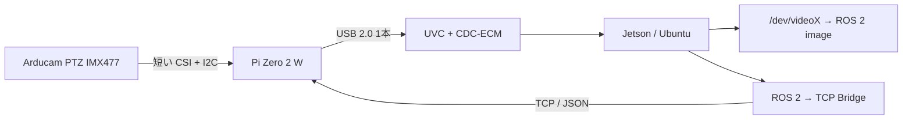
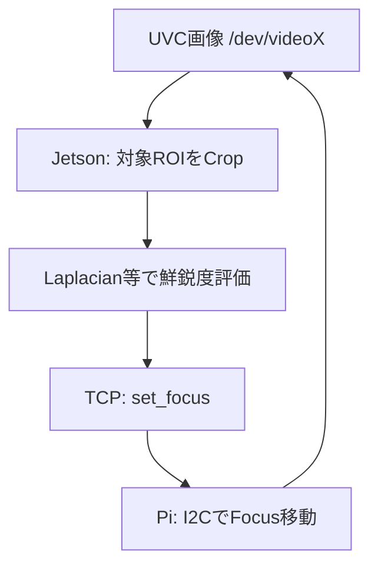
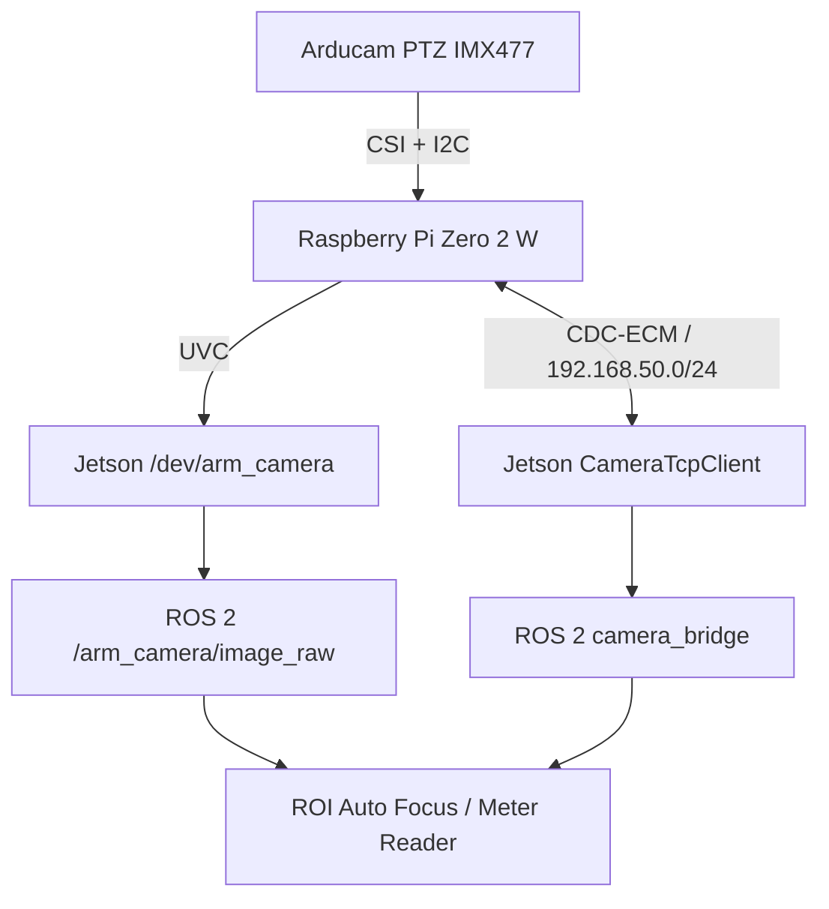

# Arducam PTZ IMX477 + Raspberry Pi Zero 2 W をロボットアーム先端カメラとして使う

## 1. 結論

ロボットアーム先端に Arducam PTZ IMX477 を搭載する場合は、MIPI CSI-2 の FPC ケーブルをアーム全体に引き回すのではなく、**カメラのすぐ近くに Raspberry Pi Zero 2 W を置き、Jetson とは USB ケーブル 1 本で接続する**構成を推奨する。

USB は Linux USB Gadget の複合デバイスとして構成し、1 本の USB ケーブル上に次の 2 機能を載せる。

- UVC: Jetson から通常の USB カメラ `/dev/videoX` として映像取得
- CDC-ECM: Pi Zero 2 W と Jetson の間に USB Ethernet を作り、カメラ制御を TCP/IP で送受信

カメラ制御は Pi Zero 2 W 上の TCP サーバに一本化し、ROS 2 を使う場合は Jetson 上の ROS 2 ノードが TCP サーバへ中継する。

この設計にすると Pi Zero 2 W に ROS 2 を入れる必要がない。



ROS 2 を使わない試験時も、Jetson や PC から TCP コマンドを直接送れば Zoom / Focus を操作できる。

---

## 2. この構成を選ぶ理由

### 長い CSI/FPC を使わなくてよい

IMX477 は MIPI CSI-2 カメラなので、長い FPC を可動アーム内に通す構成は信号品質・ノイズ・屈曲耐久性の面で扱いづらい。

カメラと Pi Zero 2 W の間だけ短い FPC にし、長距離部分を通常の USB ケーブルに変換する。

### Jetson からは普通の USB カメラに見える

Raspberry Pi Zero 2 W は USB OTG に対応しており、Linux USB Gadget を使って UVC カメラとして動作させられる。

Jetson 側では例えば次のように見える。

```text
UVC Gadget:
    /dev/video0
```

したがって ROS 2 側は Arducam 固有の CSI ドライバを意識しなくてよい。

### ROS 2 と非 ROS 2 の両方に対応できる

制御を次の 3 層に分離する。

```text
Arducam lens controller
        ↑ I2C
Pi Zero 2 W: camera_control_server.py
        ↑ TCP / JSON
Jetson: CameraTcpClient
        ↑
   ┌────┴─────────────┐
   │                  │
ROS 2 Service      TCPを直接使用
```

つまりカメラ固有コードを ROS 2 ノードの中に直接書かない。

---

## 3. ハードウェア構成

### アーム先端

- Arducam B016712MP / PTZ IMX477 系
- Raspberry Pi Zero 2 W
- カメラに適合する短い CSI FPC
- Arducam レンズコントローラと Pi の I2C 接続
- microSD

### アーム内部～Jetson

- データ通信対応 microUSB ケーブル
- Jetson の USB Host ポート

Pi Zero 2 W では **USB と書かれた OTG 対応ポート**を Jetson に接続する。`PWR IN` 側はデータ通信には使えない。

USB から Pi とレンズ系を給電する場合は、Zoom / Focus モータ動作時を含めて電源容量を確認する。USB と別電源を同時に直結して 5 V を二重給電する構成は避け、必要なら電源分離を考慮したハブや基板を使用する。

---

## 4. ソフトウェアの役割分担

| 場所 | ソフトウェア | 役割 |
|---|---|---|
| Pi Zero 2 W | libcamera / Picamera2 | IMX477 の取得 |
| Pi Zero 2 W | uvc-gadget | USB UVC 映像化 |
| Pi Zero 2 W | Arducam Focuser | Zoom / Focus の I2C 制御 |
| Pi Zero 2 W | TCP camera server | 制御コマンド受付 |
| Jetson | V4L2 / ROS 2 camera node | `/dev/videoX` の映像取得 |
| Jetson | ROS 2 camera bridge | ROS 2 Service → TCP 変換 |
| Jetson | autofocus | UVC画像を評価して Focus を TCP 制御 |

重要なのは、**映像経路と制御経路を分ける**ことである。

```text
映像: IMX477 → Pi → UVC → /dev/videoX → ROS 2
制御: ROS 2 / TCP client → USB Ethernet → Pi → I2C → Lens
```

---

## 5. OS 選択について

Raspberry Pi 公式の「Pi Zero 2 W を UVC Webcam にする」手順は、2026年8月時点でも **Bullseye 向けで、Bookworm 以降には未更新**と明記されている。

そのため最初の試作では、最新 OS へ一度に移植するよりも、Arducam と Raspberry Pi の既存手順に近い環境で UVC とレンズ制御を別々に確認してから統合する方が切り分けしやすい。

注意: 現在の Raspberry Pi Imager で単に `Legacy` を選んでも、それが Bullseye とは限らない。UVC 公式チュートリアルをそのまま再現する場合は **OS の Debian バージョンを明示的に確認する**。

確認:

```bash
cat /etc/os-release
```

製品運用で現行 Raspberry Pi OS を使いたい場合は、最初に Bullseye 系でハードウェアを検証した後、UVC Gadget 部分だけを現行 OS に移植して再検証するのが安全である。

---

## 6. Step 1: Arducam PTZ IMX477 を Pi Zero 2 W 単体で動かす

最初から UVC 化せず、まず Pi 上でカメラとレンズ制御を確認する。

### 必要パッケージ

Arducam の B016712MP 向けサンプルでは OpenCV、Picamera2、NumPy と I2C を使用している。

```bash
sudo apt update
sudo apt install -y \
  git \
  i2c-tools \
  python3-opencv \
  python3-picamera2 \
  python3-numpy \
  python3-smbus2
```

Arducam の公式コントローラを取得する。

```bash
cd ~
git clone https://github.com/ArduCAM/PTZ-Camera-Controller.git
```

### I2C を有効化

```bash
sudo raspi-config
```

`Interface Options` → `I2C` → `Enable` を選択して再起動する。

### IMX477 を有効化

OS によって設定ファイルの場所が異なるので、実在する方を編集する。

```text
/boot/firmware/config.txt
```

または

```text
/boot/config.txt
```

Arducam の B016712MP 手順では、自動検出を無効化して IMX477 overlay を明示する構成が案内されている。

```ini
camera_auto_detect=0

[all]
dtoverlay=imx477
```

設定後に再起動する。

```bash
sudo reboot
```

### カメラ確認

OS 世代に応じて利用できる方を使用する。

```bash
rpicam-hello --list-cameras
```

または

```bash
libcamera-hello --list-cameras
```

IMX477 が列挙されることを確認する。

### レンズコントローラ確認

Arducam のコントローラコードでは I2C アドレス `0x0c` を使用している。

```bash
sudo i2cdetect -y 1
```

`0c` が確認できることを目安にする。

続いて公式サンプルを実行する。

```bash
cd ~/PTZ-Camera-Controller/B016712MP
python3 FocuserExample.py
```

この段階で次を確認する。

- 映像が出る
- Zoom が動く
- Focus が動く
- Auto Focus サンプルが動く

B016712MP 用コードでは Zoom / Focus の制御値はそれぞれ概ね `0..2100` の範囲として実装されている。ただしアプリ側にはこの生値を公開せず、後述のように `0.0..1.0` に正規化する。

---

## 7. Step 2: まず UVC だけ動かす

Raspberry Pi 公式の UVC Webcam チュートリアルをベースにする。

必要パッケージの例:

```bash
sudo apt install -y git meson libcamera-dev libjpeg-dev
git clone https://gitlab.freedesktop.org/camera/uvc-gadget.git
cd uvc-gadget
make uvc-gadget
cd build
sudo meson install
sudo ldconfig
```

Pi Zero 2 W の USB OTG を有効化する。設定ファイルは OS に応じて `/boot/firmware/config.txt` または `/boot/config.txt` を使用する。

```ini
dtoverlay=dwc2,dr_mode=otg
```

Raspberry Pi 公式サンプルの UVC Gadget スクリプトをベースにし、最初は **UVC のみ**で動作確認する。

Jetson 側:

```bash
v4l2-ctl --list-devices
```

例えば次のように列挙されればよい。

```text
UVC Gadget:
    /dev/video0
```

対応フォーマットも確認する。

```bash
v4l2-ctl -d /dev/video0 --list-formats-ext
```

USB 2.0 なので、最初の安定性確認は 720p または 1080p の MJPEG から始める。

---

## 8. Step 3: UVC + USB Ethernet の複合デバイスにする

UVC が単独で動いてから CDC-ECM を追加する。

Raspberry Pi 公式 UVC スクリプトでは最後におおむね次の順序で Gadget を作る。

```text
create UVC function
    ↓
config に link
    ↓
UDC に bind
    ↓
uvc-gadget 起動
```

CDC-ECM は **UDC に bind する前**に追加する。

概念的には次を追加する。

```bash
# g1 ディレクトリ内で実行
mkdir -p functions/ecm.usb0

# locally administered MAC address の例
echo "02:12:34:56:78:02" > functions/ecm.usb0/dev_addr
echo "02:12:34:56:78:01" > functions/ecm.usb0/host_addr

ln -s functions/ecm.usb0 configs/c.1/ecm.usb0
```

最終的な USB Gadget の構造は次のようになる。

```text
g1
├── functions
│   ├── uvc.0
│   └── ecm.usb0
└── configs/c.1
    ├── uvc.0 -> ../../functions/uvc.0
    └── ecm.usb0 -> ../../functions/ecm.usb0
```

その後 UDC に bind する。

```bash
echo "$UDC" > UDC
```

Pi 側の USB Ethernet を固定 IP にする。

```bash
sudo ip link set usb0 up
sudo ip addr replace 192.168.50.2/24 dev usb0
```

Jetson 側では新しく追加された USB Ethernet インターフェースを確認する。

```bash
ip -br link
```

インターフェース名は `usb0` とは限らず、`enx...` になることがある。

仮に `enx021234567801` だった場合:

```bash
sudo ip link set enx021234567801 up
sudo ip addr replace 192.168.50.1/24 dev enx021234567801
```

確認:

```bash
ping 192.168.50.2
```

これで同じ USB ケーブル上に、

```text
/dev/videoX          UVC 映像
192.168.50.1 ↔ .2   カメラ制御用ネットワーク
```

の 2 経路ができる。

### Jetson 側 IP を永続化する場合

Jetson の Ubuntu が NetworkManager を使用している場合は、実際のインターフェース名に対して固定 IPv4 接続を作成できる。

```bash
nmcli connection add \
  type ethernet \
  ifname enx021234567801 \
  con-name arm-camera-usb \
  ipv4.method manual \
  ipv4.addresses 192.168.50.1/24 \
  ipv6.method disabled
```

インターフェース名は必ず実機で確認して置き換える。

---

## 9. Step 4: Pi Zero 2 W に TCP カメラ制御サーバを置く

TCP は改行区切り JSON にしておくと、Python、C++、ROS 2、`nc` のどれからでも扱いやすい。

### プロトコル例

Zoom を 70% にする:

```json
{"cmd":"set_zoom","value":0.70}
```

Focus を 40% にする:

```json
{"cmd":"set_focus","value":0.40}
```

状態取得:

```json
{"cmd":"get_state"}
```

応答:

```json
{"ok":true,"zoom":0.7,"focus":0.4}
```

外部 API では Arducam の生値 `0..2100` を直接使わず、`0.0..1.0` に正規化しておく。将来レンズを変更しても ROS 2 API を維持しやすい。

### Pi 側 `camera_control_server.py` の基本形

`Focuser.py` は B016712MP ディレクトリのものを使用する。

```python
#!/usr/bin/env python3
import json
import socketserver
import threading

from Focuser import Focuser


class LensController:
    def __init__(self, i2c_bus=1):
        self._focuser = Focuser(i2c_bus)
        self._lock = threading.Lock()

    def _set_normalized(self, option, value):
        value = max(0.0, min(1.0, float(value)))
        info = self._focuser.opts[option]
        raw = round(
            info["MIN_VALUE"]
            + value * (info["MAX_VALUE"] - info["MIN_VALUE"])
        )
        self._focuser.set(option, raw)
        return value

    def _get_normalized(self, option):
        info = self._focuser.opts[option]
        raw = self._focuser.get(option)
        return (
            (raw - info["MIN_VALUE"])
            / (info["MAX_VALUE"] - info["MIN_VALUE"])
        )

    def execute(self, request):
        cmd = request.get("cmd")

        with self._lock:
            if cmd == "ping":
                return {"ok": True}

            if cmd == "set_zoom":
                value = self._set_normalized(
                    Focuser.OPT_ZOOM, request["value"]
                )
                return {"ok": True, "zoom": value}

            if cmd == "set_focus":
                value = self._set_normalized(
                    Focuser.OPT_FOCUS, request["value"]
                )
                return {"ok": True, "focus": value}

            if cmd == "get_state":
                return {
                    "ok": True,
                    "zoom": self._get_normalized(Focuser.OPT_ZOOM),
                    "focus": self._get_normalized(Focuser.OPT_FOCUS),
                }

        return {"ok": False, "error": f"unknown command: {cmd}"}


LENS = LensController()


class CameraRequestHandler(socketserver.StreamRequestHandler):
    def handle(self):
        for line in self.rfile:
            try:
                request = json.loads(line.decode("utf-8"))
                response = LENS.execute(request)
            except Exception as exc:
                response = {"ok": False, "error": str(exc)}

            self.wfile.write(
                (json.dumps(response) + "\n").encode("utf-8")
            )
            self.wfile.flush()


class CameraServer(socketserver.ThreadingTCPServer):
    allow_reuse_address = True
    daemon_threads = True


if __name__ == "__main__":
    # USB Ethernet からだけ受ける。0.0.0.0 で全IFに公開しない。
    with CameraServer(("192.168.50.2", 5000), CameraRequestHandler) as server:
        server.serve_forever()
```

ポイント:

- `192.168.50.2` にだけ bind し、Wi-Fi 側へ制御ポートを公開しない
- I2C 操作は lock して同時実行を防ぐ
- Zoom / Focus は正規化値で外部公開する
- B016712MP の `Focuser.py` をそのまま低レベルドライバとして使う

Arducam のサンプルには `Fix / Adjust` モードがあり、手動 Zoom / Focus 操作前にモード切替を行う実装もある。実機では公式 `FocuserExample.py` でモード動作を確認してから、必要ならサーバ起動時に `OPT_MODE` を設定する。ここはレンズコントローラのファームウェア差を吸収する場所とする。

### TCP だけで動作確認

Jetson から:

```bash
printf '{"cmd":"ping"}\n' | nc 192.168.50.2 5000
```

```bash
printf '{"cmd":"set_zoom","value":0.7}\n' | nc 192.168.50.2 5000
```

```bash
printf '{"cmd":"set_focus","value":0.4}\n' | nc 192.168.50.2 5000
```

```bash
printf '{"cmd":"get_state"}\n' | nc 192.168.50.2 5000
```

ここまで動けば ROS 2 とは完全に独立してカメラ制御を検証できる。

---

## 10. Step 5: Jetson 側の ROS 2 Bridge

ROS 2 ノードは I2C を直接操作せず、TCP クライアントとして Pi の `camera_control_server.py` を呼ぶ。

推奨インターフェース:

| ROS 2 名 | 型 | 内容 |
|---|---|---|
| `/arm_camera/set_zoom` | 独自 Service | `0.0..1.0` |
| `/arm_camera/set_focus` | 独自 Service | `0.0..1.0` |
| `/arm_camera/autofocus` | `std_srvs/srv/Trigger` | AF実行 |
| `/arm_camera/image_raw` | `sensor_msgs/msg/Image` | UVC映像 |

例えば `SetNormalized.srv` を次のようにする。

```text
float32 value
---
bool success
string message
```

ROS 2 ノード内では次のように変換するだけでよい。

```text
/arm_camera/set_zoom(value=0.7)
          ↓
{"cmd":"set_zoom","value":0.7} + LF
          ↓ TCP
Pi Zero 2 W
          ↓ I2C
Zoom motor
```

ROS 2 側の TCP クライアントは例えば次のような小さい関数にできる。

```python
import json
import socket


def camera_command(request, host="192.168.50.2", port=5000):
    payload = (json.dumps(request) + "\n").encode("utf-8")

    with socket.create_connection((host, port), timeout=2.0) as sock:
        sock.sendall(payload)
        response = sock.makefile("rb").readline()

    return json.loads(response.decode("utf-8"))
```

Zoom Service callback は概念的に次だけである。

```python
result = camera_command({
    "cmd": "set_zoom",
    "value": request.value,
})

response.success = result["ok"]
response.message = json.dumps(result)
```

これなら将来 Pi を別 SBC に交換しても、TCP プロトコルが同じなら ROS 2 側をほぼ変更しなくてよい。

---

## 11. UVC 映像を ROS 2 に Publish する

Jetson では Pi は通常の V4L2 カメラなので、例えば `v4l2_camera` を使用できる。

ROS 2 Humble の例:

```bash
sudo apt install ros-humble-v4l2-camera
```

```bash
ros2 run v4l2_camera v4l2_camera_node --ros-args \
  -p video_device:=/dev/video0 \
  -r image_raw:=/arm_camera/image_raw
```

実際の `/dev/videoX` は起動順で変わる可能性があるため、製品化時は UVC Gadget の VID/PID/serial を使って udev の固定 symlink、例えば `/dev/arm_camera` を作る方がよい。

---

## 12. Auto Focus は Jetson 側で実行するのがおすすめ

ここはこの構成で重要なポイントである。

Pi 上の `uvc-gadget` が IMX477 を使用中に、別プロセスの Arducam AutoFocus サンプルが同じカメラを同時に開こうとすると、カメラ所有の競合が起きる可能性がある。

そのため実運用では、**AF の画質評価を Jetson 側で行い、Focus モータだけ TCP で Pi に動かさせる**構成が扱いやすい。



実際には次の順序にする。

1. Zoom を設定
2. 数フレーム待つ
3. Focus を粗く sweep
4. 各 Focus 位置で対象 ROI の鮮鋭度を計算
5. 最良位置付近だけ細かく sweep
6. 最良 Focus に固定
7. 圧力計を読み取る

鮮鋭度指標の簡単な例:

```python
gray = cv2.cvtColor(roi, cv2.COLOR_BGR2GRAY)
score = cv2.Laplacian(gray, cv2.CV_64F).var()
```

画面全体ではなく **圧力計の文字盤 ROI** だけを評価する。背景のエッジへフォーカスが引っ張られるのを防げる。

この AF 処理を関数化し、

- ROS 2 使用時: `/arm_camera/autofocus` Service から呼ぶ
- ROS 2 非使用時: 普通の Python CLI から呼ぶ

ようにすれば、AF アルゴリズムも共通化できる。

---

## 13. 圧力計読み取り時の推奨シーケンス

```text
1. アームを圧力計の方向へ向ける
        ↓
2. UVC映像から圧力計を検出
        ↓
3. set_zoom
        ↓
4. ROIベース Auto Focus
        ↓
5. Focus固定
        ↓
6. 露出・ゲインを可能なら固定
        ↓
7. 高品質フレーム取得
        ↓
8. 文字盤 / 針検出
        ↓
9. 針角度 → 圧力値へ変換
```

Zoom を動かすたびに Focus を取り直す前提にする。

---

## 14. 12MP 静止画について

IMX477 自体は 4056×3040 の約12MPだが、Raspberry Pi 公式の UVC Gadget サンプルは 640×480、1280×720、1920×1080 などの UVC フォーマットを定義している。

したがって **UVC 化しただけで Jetson から常時 12MP USB カメラとして使えるわけではない**。

まずは次の構成を推奨する。

```text
通常運用
  720p / 1080p UVC
       ↓
対象検出・アーム位置合わせ
       ↓
Zoom + AF
```

12MP 静止画が読み取り精度上どうしても必要になった場合だけ、第2段階として高解像度 Snapshot API を追加する。

その場合は `uvc-gadget` と Picamera2 が同時に IMX477 を開かないよう、次のどちらかにする。

1. UVC ストリームを一時停止 → 12MP JPEG 撮影 → TCP で Jetson へ転送 → UVC 再開
2. カメラを開くプロセスを1つに統合し、そのプロセスから UVC と Snapshot の両方へ配信

最初の実装では 12MP Snapshot まで一度に作らず、1080p + 光学 Zoom で圧力計読み取り精度を評価してから追加する。

---

## 15. 起動時に自動実行する

最終的には Pi の起動時に次の順で立ち上げる。

```text
1. USB Gadget 作成
2. UVC + CDC-ECM bind
3. usb0 = 192.168.50.2/24
4. uvc-gadget 起動
5. camera_control_server.py 起動
```

`rc.local` より systemd Service に分ける方がログ・再起動・依存関係を管理しやすい。

例:

```text
robot-camera-gadget.service
    ├─ UVC Gadget
    ├─ CDC-ECM
    └─ 192.168.50.2

arm-camera-control.service
    └─ camera_control_server.py :5000
```

確認:

```bash
systemctl status robot-camera-gadget.service
systemctl status arm-camera-control.service
```

ログ:

```bash
journalctl -u robot-camera-gadget.service -b
journalctl -u arm-camera-control.service -b
```

---

## 16. 実装・検証する順番

一度に全部組むのではなく、次の順で確認すると問題箇所を切り分けやすい。

### Phase 1: Pi 単体

- IMX477 が認識される
- `/dev/i2c-1` が使える
- Arducam `FocuserExample.py` で Zoom / Focus が動く
- Arducam AF サンプルの挙動を確認

### Phase 2: UVC のみ

- Jetson に `/dev/videoX` が現れる
- 720p / 1080p で安定して映る

### Phase 3: USB Ethernet

- Jetson `192.168.50.1`
- Pi `192.168.50.2`
- `ping 192.168.50.2` が通る

### Phase 4: TCP 制御

- `nc` から `set_zoom`
- `nc` から `set_focus`
- `get_state`

### Phase 5: ROS 2

- `/arm_camera/image_raw`
- `/arm_camera/set_zoom`
- `/arm_camera/set_focus`
- `/arm_camera/autofocus`

### Phase 6: 圧力計認識

- 対象検出
- Zoom 自動決定
- ROI AF
- 針角度推定

---

## 17. トラブルシュート

### Jetson に `/dev/videoX` が出ない

Pi:

```bash
ls /sys/class/udc
ls /sys/kernel/config/usb_gadget
```

Jetson:

```bash
lsusb
v4l2-ctl --list-devices
dmesg --follow
```

USB ケーブルが充電専用でないこと、Pi Zero 2 W の `USB` 側ポートへ接続していることを確認する。

### 映像は出るが TCP が通らない

Pi:

```bash
ip -br addr
ss -lntp | grep 5000
```

Jetson:

```bash
ip -br addr
ping 192.168.50.2
```

CDC-ECM インターフェース名が想定と違っていないか確認する。

### Zoom / Focus が動かない

```bash
sudo i2cdetect -y 1
```

まず `0x0c` のコントローラが見えるか確認し、TCP サーバを止めて Arducam の `FocuserExample.py` に戻って切り分ける。

### Zoom 後にピントが外れる

故障ではなく、可変焦点レンズでは Zoom と Focus が連動するため起こり得る。

運用シーケンスを必ず、

```text
Zoom → AF → 読み取り
```

にする。

### 動作中に Pi が再起動する

Zoom / Focus モータ動作時の電圧降下を疑う。USB ケーブルの電圧降下、Jetson 側 USB の供給能力、5 V 系の設計を確認する。

---

## 18. 最終的な推奨構成



役割をまとめると次の通り。

```text
Pi Zero 2 W
  = カメラI/Oアダプタ
  = UVC化
  = Zoom/Focus I2C制御
  = TCPサーバ

Jetson
  = ROS 2
  = 画像認識
  = Auto Focus判断
  = 圧力計読み取り
```

この分離なら、アーム先端は小さく保ちつつ、ROS 2 に依存しない単体試験もでき、Jetson 側の認識処理も通常の USB カメラとして実装できる。

---

## 19. 参考資料

- Raspberry Pi: Plug-and-play Raspberry Pi USB webcam  
  https://www.raspberrypi.com/tutorials/plug-and-play-raspberry-pi-usb-webcam/
- Arducam: PTZ-Camera-Controller  
  https://github.com/ArduCAM/PTZ-Camera-Controller
- Arducam: B016712MP controller source  
  https://github.com/ArduCAM/PTZ-Camera-Controller/tree/master/B016712MP
- Arducam: IMX477 / PTZ documentation  
  https://docs.arducam.com/Raspberry-Pi-Camera/Pan-Tilt-Zoom-Camera/PTZ/

### 公式情報を読む際の注意

Raspberry Pi の UVC チュートリアルと Arducam の PTZ サンプルは OS 世代によるパスやカメラスタックの差がある。`/boot/config.txt` と `/boot/firmware/config.txt`、`libcamera-*` と `rpicam-*` などは、使用する OS イメージに合わせて読み替える。
